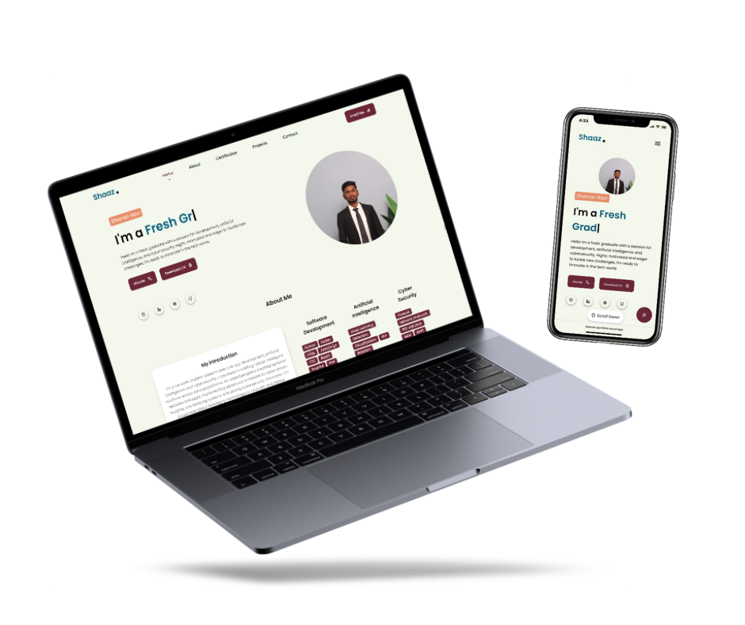

# MyPortfolio

This is My Portfolio 🙋‍♂️. I built this to display my projects, publications, and achievements in a well-organized and visually appealing manner. This is also to create a 
strong first impression for potential employers, clients, or collaborators. ⭐ 

📖 Single-Page Layout

🎨 Styled with CSS and Javascript with easy to customize colors

📱 Fully Responsive

<h3>Check out the link to see live demo of my portfolio. </h3>
<h3>https://sharran-portfolio.vercel.app/</h3>

# Template

Feel free to use my template to create your own portfolio. You can fork this repo to modify and make changes of your own. 
Please give me proper credit by linking back to <a href="https://github.com/Sharran14">My Profile</a>. Thanks! 
Good luck trying 🌱

# Support Me
Give a ⭐ if you like this website!

 

